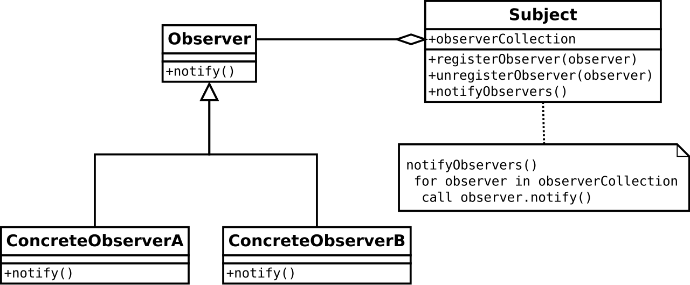
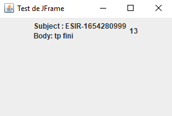

# TP 1
## Présentation:

Le patron observateur est un patron de conception de la famille des patrons comportementaux. Il s'agit de l'un des vingt-trois patrons de l'ouvrage du « Gang of Four » Design Patterns – Elements of Reusable Object-Oriented Software1.

Il est utilisé pour envoyer un signal à des modules qui jouent le rôle d'observateurs. En cas de notification, les observateurs effectuent alors l'action adéquate en fonction des informations qui parviennent depuis les modules qu'ils observent (les observables).

Les notions d'observateur et d'observable permettent de limiter le couplage entre les modules aux seuls phénomènes à observer. Le patron permet aussi une gestion simplifiée d'observateurs multiples sur un même objet observable.

Il est recommandé dès qu'il est nécessaire de gérer des évènements, quand une classe déclenche l'exécution d'une ou plusieurs autres.

## Structure:

Dans ce patron, le sujet observable se voit attribuer une collection d'observateurs qu'il notifie lors de changements d'états. Chaque observateur concret est chargé de faire les mises à jour adéquates en fonction des changements notifiés.

Ainsi, l'observé n'est pas responsable des changements qu'il entraîne sur les observateurs.

## Notre cas:
Dans notre cas nous avons deux observateurs MailLabel et CounterObserver qui pointent tout les deux sur l’observé qui est MailBox, l’objectif c’est que à chaque fois que la boite mail reçoit un message, MailLabel nous affiche le corps du message et CounterObserver le nombre total des mails reçu.
 
Résultat:

