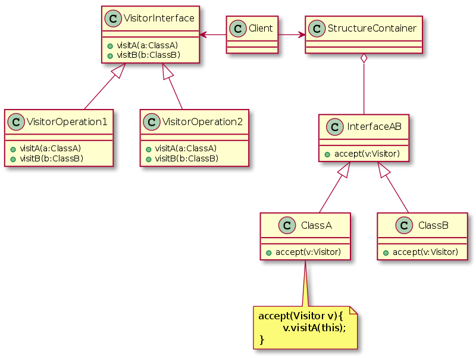
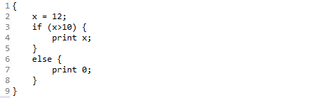
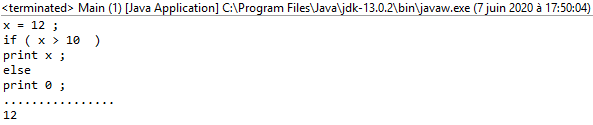

# TP 2
## Présentation:

En programmation orientée objet et en génie logiciel, le patron de conception comportemental visiteur est une manière de séparer un algorithme d'une structure de données.

## Principe:

Ce modèle de conception permet à une classe externe d'être informée du type exact d'instances d'un ensemble de classes. Cela permet de mettre en place un traitement adapté aux détails publics des objets en cause. Par exemple un visiteur est idéal pour réaliser un rapport.

Déporter des opérations contenues dans une classe vers une autre peut sembler mauvais au sens de la POO car l'ajout ou la modification d'une classe n’entraîne pas l'adaptation des visiteurs existants, ce modèle est utile lorsqu'on a un ensemble de classes fermées (par exemple fourni par un tiers) et que l'on veut effectuer un nouveau traitement sur ces classes.

En pratique, le modèle de conception visiteur est réalisé de la façon suivante : chaque classe pouvant être « visitée » doit mettre à disposition une méthode publique « accepter » prenant comme argument un objet du type « visiteur ». La méthode « accepter » appellera la méthode « visite » de l'objet du type « visiteur » avec pour argument l'objet visité. De cette manière, un objet visiteur pourra connaître la référence de l'objet visité et appeler ses méthodes publiques pour obtenir les données nécessaires au traitement à effectuer (calcul, génération de rapport, etc.).

En pratique un visiteur permet d'obtenir le même effet que d'ajouter une nouvelle méthode virtuelle à un ensemble de classes qui ne le permet pas.

Notre cas: 

Fichier fournie:

Résultat du pretty printer:

