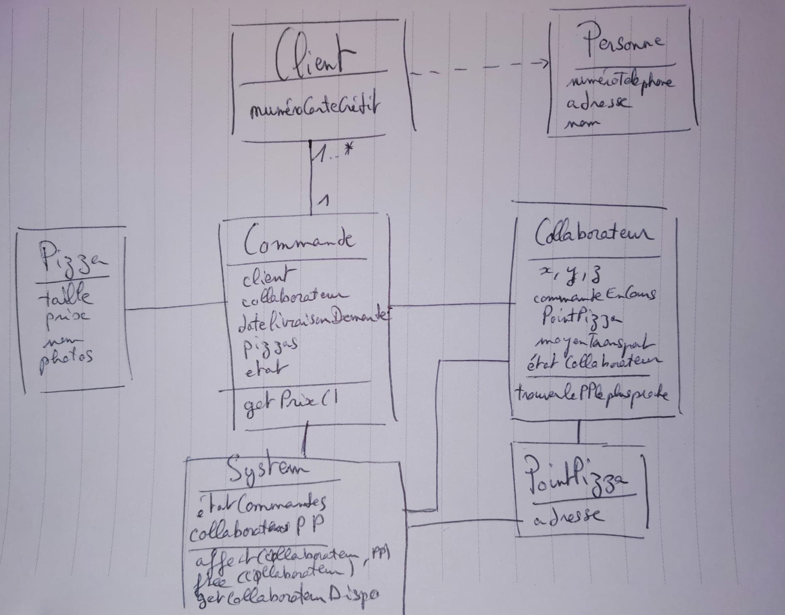

# TP 3 :

**Présentation:**

Un décorateur est le nom d'un patron de conception de structure.

Un décorateur permet d'attacher dynamiquement de nouveaux comportements ou responsabilités à un objet. Les décorateurs offrent une alternative assez souple à l'héritage pour composer de nouvelles fonctionnalités

**Apercu:**

Le pattern Décorateur est l'un des vingt-trois patterns GOF. Il résout les problématiques suivantes :

L'ajout (et la suppression) des responsabilités à un objet dynamiquement au moment de l'exécution.

Il constitue une alternative aux sous-classes pour une surcharge flexible des fonctionnalités.

Quand on utilise l'héritage, les différentes sous-classes étendent une classe mère en différentes manières. Mais une extension est attachée à la classe au moment de la compilation, et ne peut pas changer à l'exécution.

## Question 1:

- Pas besoin de faire 2 classes de Pizza, une seule suffit en ajoutant un paramètre qui définit la taille.

- Il y a des classes inutiles, par exemple la classe PointGPS peut être enlevée en ajoutant 3 attributs dans la classe Collaborateur.

- Il faudrait avoir des informations sur le collaborateur, par exemple si il est occupé à livrer ou non.

- Une information importante à savoir pour le système (la boîte) est l'état des commandes, il faut donc le rajouter;

- La classe MoyendeTransport peut être incluse dans la classe Collaborateur, c'est plus simple.

## Question 2:

Le pattern decorator est une alternative à l'héritage. Ce dernier, si il est trop utilisé, peut vite amener des programmes très complexes et on peut s'y perdre facilement.

Il est par conséquent beaucoup plus compliqué de changer certaines fonctions par exemple.

## Question 3:

Le pattern state permet d'être bien plus souple car on pourra appeler des méthodes différentes selon l'état de la pizza et donc de la commande.

Cela va permettre d'avoir un système qui va être plus performant car il va être adapté aux différentes situations.

voilà le diagramme de classe du tp:

